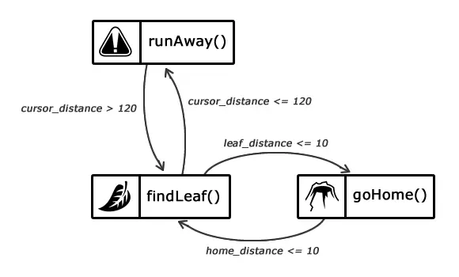

# FSM

**Описание:**  
Этот проект демонстрирует применение конечного автомата (Finite State Machine, FSM) для управления состояниями в приложении. Мы описываем возможные состояния, события и переходы между ними, что обеспечивает предсказуемость и упрощает поддержку бизнес-логики.

---

## Принцип работы конечного автомата

Конечный автомат — это математическая модель, состоящая из:

-   **Состояний** — различные этапы или положения системы.
-   **Событий** — действия или условия, которые могут вызвать переход между состояниями.
-   **Переходов** — правила, определяющие, как и когда система переходит из одного состояния в другое.



В этом проекте мы описываем конечный автомат:

-   Декларативно определять состояния и переходы.
-   Обрабатывать асинхронные события и побочные эффекты.
-   Легко тестировать и масштабировать логику приложения.

## Установка

```bash
git clone https://github.com/ManoilAlexandr/FSM.git
cd FSM
npm install
```
